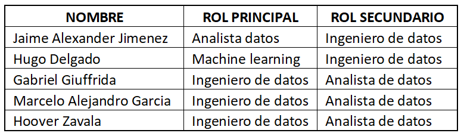
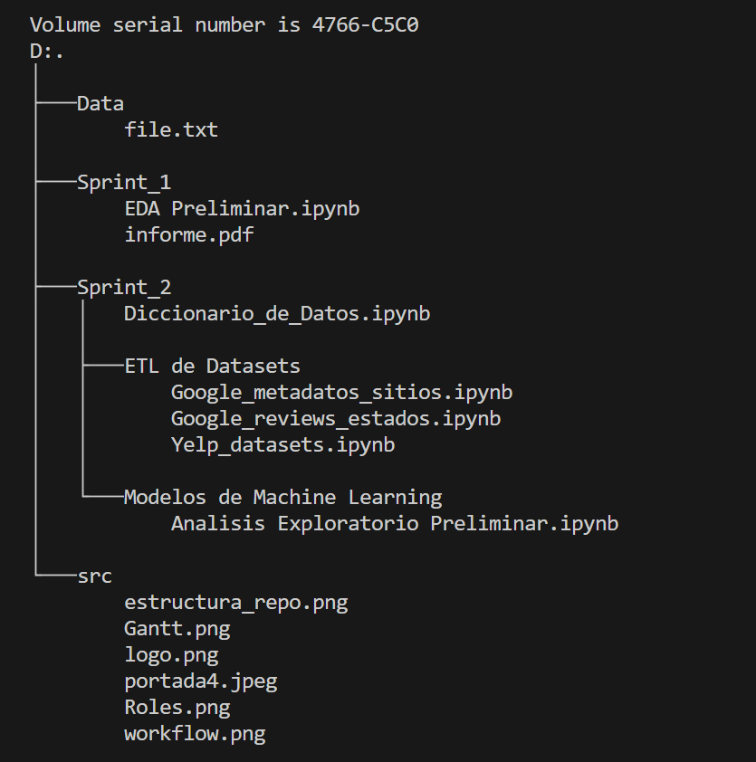
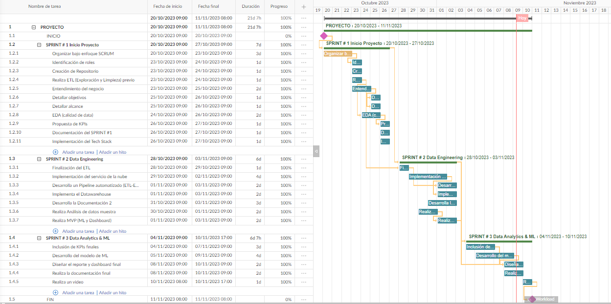
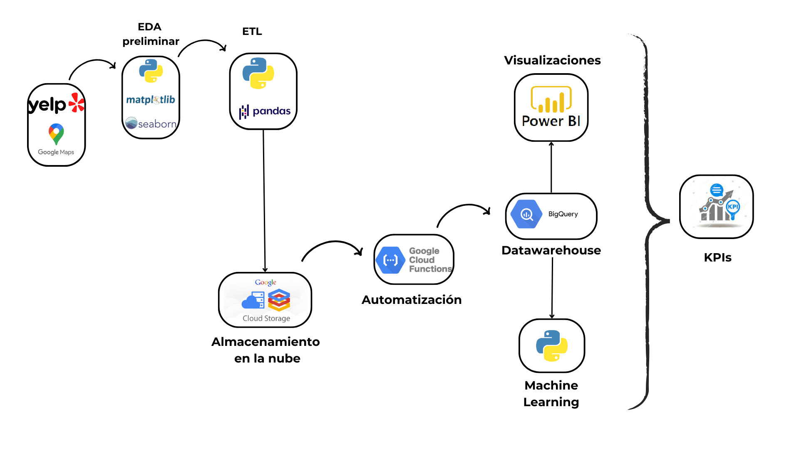

# <h1 align=center> **`PROYECTO DE ANALISIS DE DATOS`** </h1>

# <h1 align=center>**`Analisis del Mercado Gastronomico - Ocio en USA`**</h1>

    
    

# <h1 align=center>**`Iterable Consulting`**</h1>

# <h3 align=center>**`Data Science | Data Analytics | MArketing Data & BI`**</h3>

<!--
**`Data Engineering | Data Science | BI & Data Analytics`**  
-->
<!--
# <h1 align=center>**`Hoover Zavala`**</h1><h3 align=center>`Data Engineering | BI & Data Analytics | Data Science`</h3>
-->

 
 

 

## Tabla de Contenido

1. **[Introducción](#1-introduccion)**
2. **[Objetivos y Alcance del Proyecto](#2-objetivos-y-alcance-del-proyecto)**
3. **[Roles](#3-roles)**
4. **[Etapas del Proyecto](#4-etapas-del-proyecto)**
5. **[Estructura del Repositorio](#5-estructura-del-repositorio)**
6. **[Metodologia de Trabajo y Gestión de las tareas](#6-metodologia-de-trabajo-y-gestión-de-las-tareas)**
7. **[Tech Stack](#7-stack-tecnologico-utilizado)**
8. **[Arquitectura y Workflow](#8-arquitectura-y-workflow)**
9. **[Analisis Exploratorio de Datos](#9-analisis-exploratorio-de-datos)**
10. **[Modelo de Machine Learning](#10-modelo-de-machine-learning)**
11. **[KPIs](#11-indicadores-clave-de-rendimiento)**
12. **[Entregables](#12-entregables)**
13. **[Cierre](#13-gracias-por-su-atencion)**

 

## 1. Introducción 

Somos Iterable Consulting, una firma de consultoría especializada en brindar soluciones de negocios basados en tecnologias escalables, robustas y basados en datos.

Nuestra labor se centra en el análisis de datos procedente de diversas fuentes y en diferentes formatos, realizar el debido procesamiento y analisis para la identificación de patrones y tendencias

[arriba](#tabla-de-contenido) 

 

## 2. Objetivos y Alcance del Proyecto

En cuanto al trabajo que nos concierne, nuestro cliente, una empresa lider en el rubro gastronomico que forma parte de un importante conglomerado  de empresas de restaurantes y afines, se ha propuesto abrir nuevas unidades de negocios en Estados Unidos, por lo que nos ha pedido elaborar un proyecto de data analytics que permita evaluar y definir los mercados del rubro gastronomico y de ocio mas atractivos para la inversion en dicho país.

Los requerimientos expresados por nuestro cliente se resumen así:  
* Predecir cuáles serán los rubros de los negocios que más crecerán (o decaerán). 
* Desplegar un analisis de mercado que les permita saber dónde es conveniente emplazar los nuevos locales de restaurantes y afines,
* La implementacion de un sistema de recomendación de restaurantes para sus usuarios basado en las experiencias registradas por distintos comensalesen en las plataformas Yeld y Google Maps sobre hoteles, restaurantes y otros negocios afines al turismo y ocio.  

Para la consecucion de estos requerimientos nuestro cliente puso a nuestra disposicion sendos datasets producidos y mantenidos por las plataformas Yelp! y Google para usarlos como fuente de datos obligatorios, aunque no de manera exclusivos.  

Entonces nuestro objetivo es el de, a partir de dicha fuente de datos, y aplicando técnicas de análisis de datos, de machine learning y visualización, implementar soluciones da datos pertinentes y extraer informacion releveante que satisfaga los requerimientos de inversion y captacion de usuarios de nuestro cliente.  

[arriba](#tabla-de-contenido)  

 

## 3. Roles

Dentro de Iterable, conformamos un equipo de trabajo de cinco personas encargado de sacar adelante el proyecto, asignando los roles especificos a cumplir por cada uno.

 

  
        

 

Cabe mencionar, que como la metodología de trabajo es por etapas, los roles pueden verse sujetos a modificación en función de las necesidades del proyecto.  

[arriba](#tabla-de-contenido) 

 

## 4. Etapas del Proyecto

Se ha dispuesto cada avance del proyecto en tres etapas de la siguiente manera:

Semana 1 - Etapa de Puesta en Marcha del proyecto y Trabajo Inicial de los Datos  
En esta etapa se contextualiza la problematica del proyecto, se definen los objetivos y el alcance así como los indicadores claves de rendimiento a evaluar. Además, se fundamenta el stack tecnologico elegido, se describe el flujo de trabajo y el EDA preliminar de los datos. 

Semana 2 - Etapa de Data Engineering  
En esta etapa se implementa el data pipeline automatizado que extrae, limpia y organiza los datos y finalmente almacena el producto final en el datawarehouse, listo para su uso posterior.
En esta etapa tambien se presenta pruebas de concepto de los entregables de la etapa que sigue (ML y Dashboard)

Semana 3 - Etapa de Data Analytics y Machine Learning  
En esta etapa final, se disponibilizan las soluciones de machine learning requeridas por el cliente y se presentan las conclusiones relacionadas al requerimiento del negocio utilizando como apoyo herramientas de visualizacion
En esta etapa tambien se hace entrega de se explica el repositorio completo y toda la documentacion del proyecto.  

[arriba](#tabla-de-contenido) 

 

## 5. Estructura del Repositorio

<!--## 3. **<u>Estructura del Repositorio</u>** -->
 

  
        

 

**`Carpeta 'Sprint_1'.-`** contiene todos los entregables de la etapa 1  
**`Carpeta 'Sprint_2'.-`** contiene todos los entregables de la etapa 2
<!--* **`'EDA.ipynb':`** implementacion del analisis exploratorio de datos. -->

**`Carpeta 'data'.-`** contiene los datasets del proyecto
<!--* **`'internet_fijo_penetracion_por_provincia_100_hogares_trimestral.csv':`** dataset proveido por la empresa -->
<!--* **`'data_prepared.csv':`** dataset final luego de implementarle a 'AccidentesAviones.csv' tareas de limpieza y transformacion de datos. -->
**`Archivo 'README.md'.-`** archivo actual.  
**`Carpeta 'src'.-`** carpeta fuente del archivo actual.  

[arriba](#tabla-de-contenido) 

 

## 6. Metodologia de Trabajo y Gestión de las tareas

El equipo de trabajo acordo la adopcion de la metodología de trabajo Scrum como instrumento de apoyo para el desarrollo en tiempo y forma de los sucesivos entregables del proyecto.  Algunas de las actividades a realizar bajo esta metodologia son la planificacion de cada estapa del proyecto, y la organizacion para el desarrollo colaborativo.

Ademas, para la gestion de las tareas se utilizo la herramienta Jira Software. Las tareas, su duración y fecha, su avance y porcentaje de completitud se presentan a continuación.

 

 

Para visualizar el diagrama de Gantt en la plataforma de Jira Software acceda al siguiente enlace:  [Diagrama de Gantt](https://grupo08henry.atlassian.net/jira/software/projects/SCRUM/boards/1/timeline)  

[arriba](#tabla-de-contenido) 

 

## 7. Stack Tecnologico Utilizado  
     
     
     
     
     
     

[arriba](#tabla-de-contenido) 

<!--  -->
 

## 8. Arquitectura y Workflow

EL equipo de trabajo opto por utilizar los servicios cloud de Google Cloud Platform para la implementacion del data pipeline automatizado, el cual incluye la ingesta de datos, automatizacion de procesos, y el despliegue de las soluciones de datos, incluido el entrenamiento del modelo de ML  
Para la automatizacion del proceso de ETL, implementamos Google Cloud Functions, al ingresar un archivo al Bucket indicado se inicia el proceso de ETL, que incluye la validacion, transformacion, limpieza y carga de datos al Data Warehouse en Big Query.

- Cloud Storage Buckets como datalake
- Cloud Functions para realizar el ETL de los datos
- BigQuery, como datawarehouse para almacenar y procesar los datos.
- Python para implementar los modelos de aprendizaje.
- Power Bi para la visualización de datos y KPIs.

El workflow del proceso se presenta a continuación:  

 

  
        

 

[arriba](#tabla-de-contenido) 

 

## 9. Analisis Exploratorio de Datos

Se realizaron tareas de importacion de librerias, carga del dataset  
Se realizaron analisis sobre todas las variables significativas   
Se confecciono un informe escrito sobre los resultados obtenidos en la etapa de analisis  

[arriba](#tabla-de-contenido) 

 

## 10. Modelo de Machine Learning

El Sistema de Recomendación a diseñar tendra las siguientes caracteristicas:

- Personalización: Proporcionar recomendaciones basadas en las preferencias de los usuarios y las tendencias de reseñas a través de los comentarios en la plataforma Yelp y Gmaps.
- Eficiencia: Optimizar el tiempo y los recursos de inversión al ofrecer recomendaciones precisas y relevantes.
- Análisis de Sentimientos: Incorporar análisis de sentimientos en las reseñas para escalar en recomendaciones personalizadas y fidedignas  

[arriba](#tabla-de-contenido) 

 
# Aqui se puede visualizar el DEPLOYMENT de los Modelos de Machine Learning " Recomendacion - Prediccion " : https://pml-1740.onrender.com/docs#/default/get_recommendations_recommendations__get

## 11. Indicadores Clave de Rendimiento

A continuación se presentan los 8 KPIs propuestos y sus métricas asociadas:

KPI 1: Aumentar las reseñas de usuarios nuevos en un 10% con respecto al año anterior  
KPI 2: Aumentar la cantidad de restaurantes nuevos reseñados en un 5% con respecto al año anterior  
KPI 3: Aumentar la cantidad de reseñas por restaurante en un 10% anual con respecto al año anterior  
KPI 5: Aumentar el promedio de calificaciones de los restaurantes en un 5% con respecto al año anterior  
KPI 6: Reducir en un 10% la cantidad de restaurantes de los que obtuvo reseñas negativas con respecto al año anterior  

[arriba](#tabla-de-contenido) 

 

<!--  

-->

## 12. Entregables

Los entregables de la semana 1 se encuentran en la carpeta Sprint_1: 

- Tratamiento de datos previo al EDA preliminar: 
    - [EDA_Preliminar.ipynb](Sprint_1/EDA_Preliminar.ipynb) 
    - [Informe.pdf](Sprint_1/Informe.pdf)  
[arriba](#tabla-de-contenido) 

Los entregables de la semana 2 se encuentran en la carpeta Sprint_2: 

- Carpeta con el tratamiento ETL del los datasets de Goglew Maps y Yelp!:  
    - [Google_metadatos_sitios.ipynb](Sprint_2/ETL_de_los_Datasets/Google_metadatos_sitios.ipynb)  
    - [Google_reviews_estados.ipynb](Sprint_2/ETL_de_los_Datasets/Google_reviews_estados.ipynb)   
    - [Yelp_datasets.ipynb](Sprint_2/ETL_de_los_Datasets/Yelp_datasets.ipynb) 
- Carpeta con subcarpetas de las implementaciones de la carga incremental  

- Carpeta del Modelo de ML con los archivos de exploracion e implementacion:  
    - [Analisis_Exploratorio_Preliminar.ipynb](Sprint_2/Modelos_Machine_Learning/Analisis_Exploratorio_Preliminar.ipynb) 
    - [Analisis EDA.ipynb](Sprint_2/Modelos_Machine_Learning/Google_EDA.ipynb) 
    - [main.py](Sprint_2/Modelos_Machine_Learning/main.py) 
    - [main3.py](Sprint_2/Modelos_Machine_Learning/main3.py)
    - [Un readme explicativo] (Sprint_2/Modelos_Machine_Learning/README.md)

    - 
- Diccionario de datos: [Diccionario_de_Datos.ipynb](Sprint_2/Diccionario_de_Datos.ipynb) 
 
Los entregables de la semana 3 se encuentran en la carpeta Sprint_3:

[arriba](#tabla-de-contenido) 

 

## 13. Gracias por su atencion
Te parecio interesante el proyecto? No olvides [regalarnos](https://github.com/Joaquin-Costamagna/PF_YELP_HENRY/stargazers) una ⭐.  
Tienes una idea en mente o encontraste algun bug? Por favor abre un [issue](https://github.com/Joaquin-Costamagna/PF_YELP_HENRY/issues) o inicia una [discusion](https://github.com/Joaquin-Costamagna/PF_YELP_HENRY/discussions).  

[arriba](#tabla-de-contenido) 

 

<!--  

[ <a href="#table-of-contents">↑ Back to top ↑</a> ]
 

## Diagrama de entidad - relación
A continuación se presenta el diagrama entidad - relación del modelo presente en nuestro datawarehouse, Big Query. 

 

 

 

A continuación se presenta el enlace al dashboard que se ha desarrollado con el propósito de proporcionar una visión en tiempo real de los datos clave que impulsarán las decisiones estratégicas del inversor. A través de una combinación de visualizaciones intuitivas, métricas esenciales y análisis detallados, nuestro objetivo es ofrecer un panorama completo y claro de la situación actual del proyecto.

Enlace al dashboard: [Panel de control](https://app-exzyyajzmkwgv3a7dos4qt.streamlit.app/)
 

## Resultados y Conclusiones

En resumen, la creación de un Data Warehouse en GCP es un paso fundamental para desbloquear el potencial de sus datos. La carga inicial y la carga incremental son etapas cruciales para asegurar que los datos sean precisos, actualizados y listos para el análisis. Google Cloud Storage ofrece un conjunto de herramientas poderosas para llevar a cabo estas tareas de manera eficiente y confiable. Al invertir en la creación y el mantenimiento de su Data Warehouse, su organización estará en una posición sólida para tomar decisiones informadas y estratégicas basadas en datos precisos y oportunos. El cual dio la oportunidad para crear un dashboard que detecta posibilidades de inversión y rastrea la evolución de la satisfacción del cliente, lo que otorga una posición competitiva destacada en el mercado de comida rápida en Florida. Asimismo, un sistema de recomendación que tiene en cuenta las preferencias de los usuarios y las tendencias en las reseñas de locales de comida rápida

 

*******IDEAS**************************************************************** 

 en las opiniones de los usuarios, con el fin de lograr una comprensión más profunda de sus experiencias, necesidades y expectativas en relación a diversos servicios.

Este proyecto responde a la necesidad del inversor gastronómico proveniente del estado de Florida que planea instalar una franquicia de comida rápida en el estado y quiere que nuestra consultora realice un análisis de dos fuentes principales de información: las opiniones de los usuarios en Yelp y Google Maps para recomendarle qué franquicia de fast food le conviene adquirir y en qué lugar del estado de Florida ubicarla. 

Disponer de un análisis detallado de la opinión de los usuarios en Yelp y cruzarlos con los de Google Maps .

En base a este nos a la tarea de realizar una exploracion analitica de los datos fuentes

 específicamente del estado de Florida en el sector de restaurantes de fast food. El cliente que nos ha contratado es un inversor que planea instalar una franquicia de comida rápida en Florida y quiere que nuestra consultora de datos (Mindful Data) realice un análisis de dos fuentes principales de información: las opiniones de los usuarios en Yelp y Google Maps para recomendarle qué franquicia de fast food le conviene adquirir. 

Para cumplir con este objetivo, nuestro equipo se ha propuesto las siguientes metas:

- Realizar un análisis de sentimientos y opiniones de las reseñas de Yelp y Google Maps para comprender la percepción de los usuarios sobre el sector fast food en Florida, Estados Unidos.

- Predicción del crecimiento o declive del sector fast food basándonos en datos históricos.

- Sistema de recomendación de restaurantes de fast food personalizado, eficiente que diversifica las franquicias.
 
Este proyecto se centrará en el análisis de las reseñas de los últimos 5 años de Yelp y Google Maps acerca de las cadenas de fast food más importantes de Florida, Estados Unidos, con el objetivo de identificar cuál es la mejor opción a la hora de adquirir una franquicia basado en un sistema de recomendación que tiene en cuenta la preferencia de los usuarios y las tendencias en las reseñas de locales de comida rápida en la ciudad de Florida. 
********************************************************************

-->
